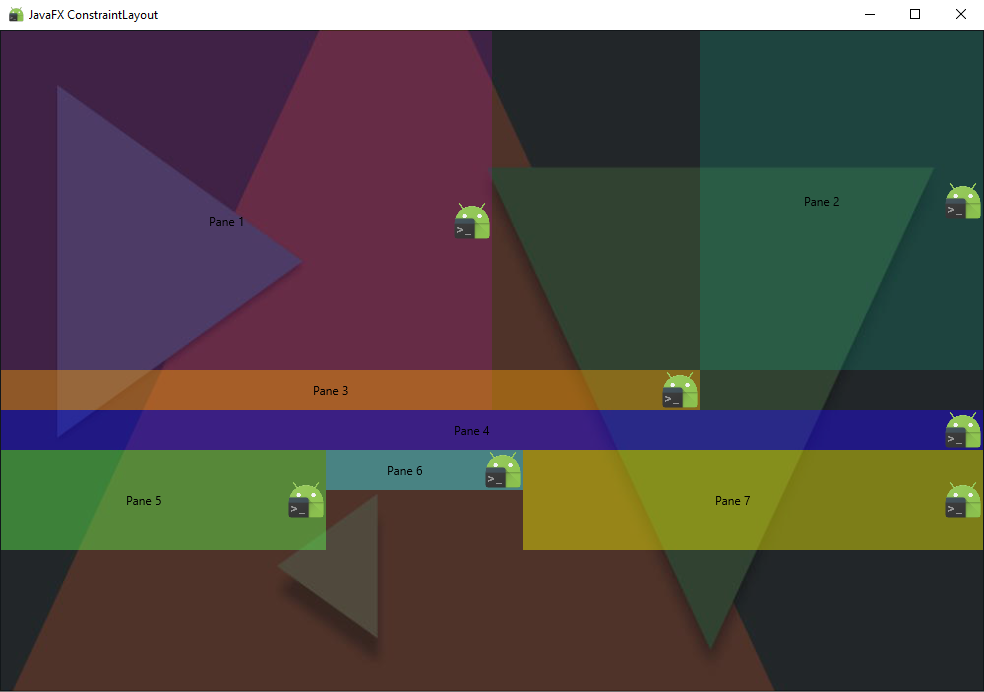

# JavaFX ConstraintLayout
JavaFX ConstraintLayout (Like Android ConstraintLayout)

How it works?
--------
* Firstly, it is ```AnchorPane``` in which ```Constraints``` are already implemented. I just want it to work automatically, as in the Android version
* You must create a custom Layout extends ```Pane``` and implement the ```ConstantLayout.Impl```
* This does not support **SceneBuilder**, if we make it perfect, i can create the **«JavaFX ConstraintWidgets Library»**



**Params**

| Param | Type | Description | Example |
| --- | --- | --- | --- |
| ```constraintWidth``` | ```String``` |  | ```100```px ```50%``` |
| ```constraintHeight``` | ```String``` |  | ```50```px ```25%``` |
| ```constraintPadding``` |```String``` |  | ```10``` or ```10 5 10 5``` |
| ```constraintMargin``` | ```String``` |  | ```10``` or ```10 5 10 5``` |
| ```constraintTop_toTopOf``` | ```String``` |  | ```parent``` of ```#paneId``` |
| ```constraintEnd_toEndOf``` | ```String``` |  | ```parent``` of ```#paneId``` |
| ```constraintBottom_toBottomOf``` | ```String``` |  | ```parent``` of ```#paneId``` |
| ```constraintStart_toStartOf``` | ```String``` |  | ```parent``` of ```#paneId``` |
| ```constraintTop_toBottomOf``` | ```String``` |  | ```parent``` of ```#paneId``` |
| ```constraintBottom_toTopOf``` | ```String``` |  | ```parent``` of ```#paneId``` |
| ```constraintStart_toEndOf``` | ```String``` | Needs to be developed: stretching by percent of parent; | ```parent``` of ```#paneId``` |
| ```constraintEnd_toStartOf``` | ```String``` | Needs to be developed: stretching by percent of parent; | ```parent``` of ```#paneId``` |

**FXML example**
```xml
<ConstraintLayout>
     <ConstraintBorderPane
             id="pane1"
             constraintWidth="50%"
             constraintTop_toTopOf="parent"
             constraintBottom_toBottomOf="#pane3"
             style="-fx-background-color: #ff00ff22;">
        <center>
           <Text strokeType="OUTSIDE" strokeWidth="0.0" text="Pane 1" BorderPane.alignment="CENTER"/>
        </center>
        <right>
           <ImageView fitHeight="40.0" fitWidth="40.0" pickOnBounds="true" preserveRatio="true" BorderPane.alignment="CENTER">
              <image>
                 <Image url="@../drawable/ic_launcher.png"/>
              </image>
           </ImageView>
        </right>
     </ConstraintBorderPane>
     <ConstraintBorderPane
             id="pane2"
             constraintWidth="50%"
             constraintEnd_toEndOf="parent"
             style="-fx-background-color: #00ffcc22;">
        <center>
           <Text strokeType="OUTSIDE" strokeWidth="0.0" text="Pane 2" BorderPane.alignment="CENTER" />
        </center>
        <right>
           <ImageView fitHeight="40.0" fitWidth="40.0" pickOnBounds="true" preserveRatio="true" BorderPane.alignment="CENTER">
              <image>
                 <Image url="@../drawable/ic_launcher.png" />
              </image>
           </ImageView>
        </right>
     </ConstraintBorderPane>
     <ConstraintBorderPane
             id="pane3"
             constraintStart_toStartOf="parent"
             constraintEnd_toStartOf="#pane2"
             constraintTop_toBottomOf="#pane2"
             style="-fx-background-color: rgba(255,162,0,0.42);">
        <center>
           <Text strokeType="OUTSIDE" strokeWidth="0.0" text="Pane 3" BorderPane.alignment="CENTER"/>
        </center>
        <right>
           <ImageView fitHeight="40.0" fitWidth="40.0" pickOnBounds="true" preserveRatio="true" BorderPane.alignment="CENTER">
              <image>
                 <Image url="@../drawable/ic_launcher.png" />
              </image>
           </ImageView>
        </right>
     </ConstraintBorderPane>
     <ConstraintBorderPane
             id="pane4"
             constraintTop_toBottomOf="#pane3"
             constraintStart_toStartOf="parent"
             constraintEnd_toEndOf="parent"
             style="-fx-background-color: rgba(32,7,255,0.42);">
        <center>
           <Text strokeType="OUTSIDE" strokeWidth="0.0" text="Pane 4" BorderPane.alignment="CENTER"/>
        </center>
        <right>
           <ImageView fitHeight="40.0" fitWidth="40.0" pickOnBounds="true" preserveRatio="true" BorderPane.alignment="CENTER">
              <image>
                 <Image url="@../drawable/ic_launcher.png" />
              </image>
           </ImageView>
        </right>
     </ConstraintBorderPane>
     <ConstraintBorderPane
             id="pane5"
             constraintWidth="33%"
             minHeight="100"
             constraintTop_toBottomOf="#pane4"
             constraintStart_toStartOf="parent"
             style="-fx-background-color: rgba(98,255,79,0.42);">
        <center>
           <Text strokeType="OUTSIDE" strokeWidth="0.0" text="Pane 5" BorderPane.alignment="CENTER"/>
        </center>
        <right>
           <ImageView fitHeight="40.0" fitWidth="40.0" pickOnBounds="true" preserveRatio="true" BorderPane.alignment="CENTER">
              <image>
                 <Image url="@../drawable/ic_launcher.png" />
              </image>
           </ImageView>
        </right>
     </ConstraintBorderPane>
     <ConstraintBorderPane
             id="pane6"
             constraintWidth="20%"
             constraintTop_toTopOf="#pane5"
             constraintStart_toEndOf="#pane5"
             style="-fx-background-color: rgba(65,245,255,0.42);">
        <center>
           <Text strokeType="OUTSIDE" strokeWidth="0.0" text="Pane 6" BorderPane.alignment="CENTER"/>
        </center>
        <right>
           <ImageView fitHeight="40.0" fitWidth="40.0" pickOnBounds="true" preserveRatio="true" BorderPane.alignment="CENTER">
              <image>
                 <Image url="@../drawable/ic_launcher.png" />
              </image>
           </ImageView>
        </right>
     </ConstraintBorderPane>
     <ConstraintBorderPane
             id="pane7"
             constraintWidth="33%"
             constraintTop_toTopOf="#pane5"
             constraintStart_toEndOf="#pane6"
             constraintEnd_toEndOf="parent"
             constraintBottom_toBottomOf="#pane5"
             style="-fx-background-color: rgba(252,250,0,0.42);">
        <center>
           <Text strokeType="OUTSIDE" strokeWidth="0.0" text="Pane 7" BorderPane.alignment="CENTER"/>
        </center>
        <right>
           <ImageView fitHeight="40.0" fitWidth="40.0" pickOnBounds="true" preserveRatio="true" BorderPane.alignment="CENTER">
              <image>
                 <Image url="@../drawable/ic_launcher.png" />
              </image>
           </ImageView>
        </right>
     </ConstraintBorderPane>
</ConstraintLayout>
```
